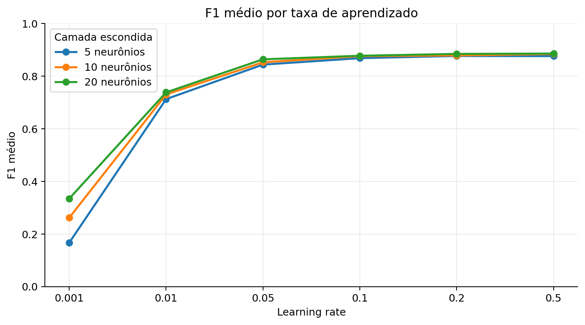
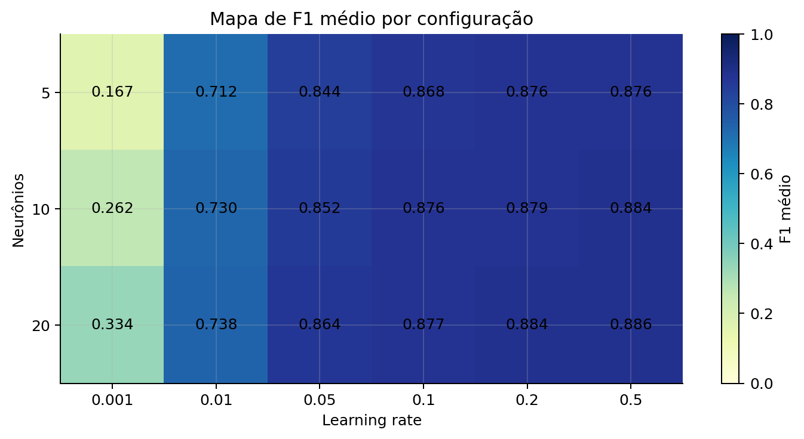
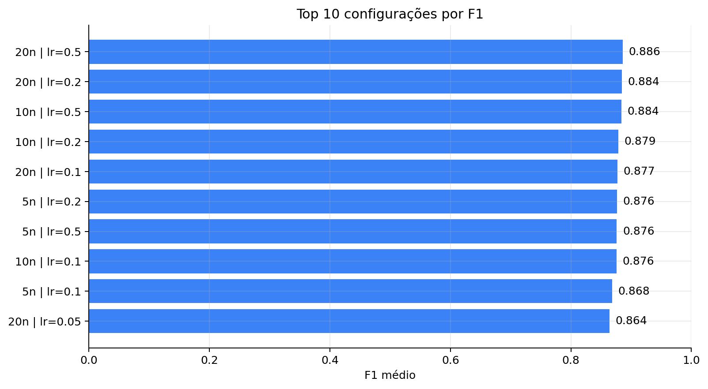
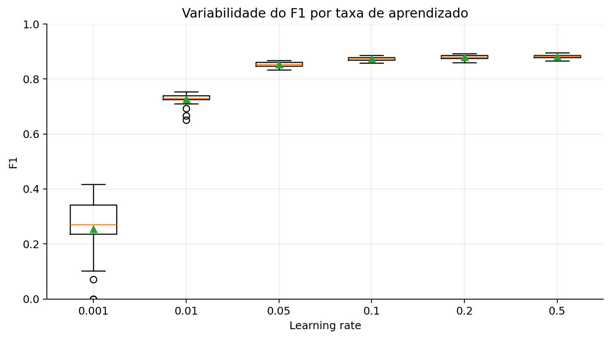
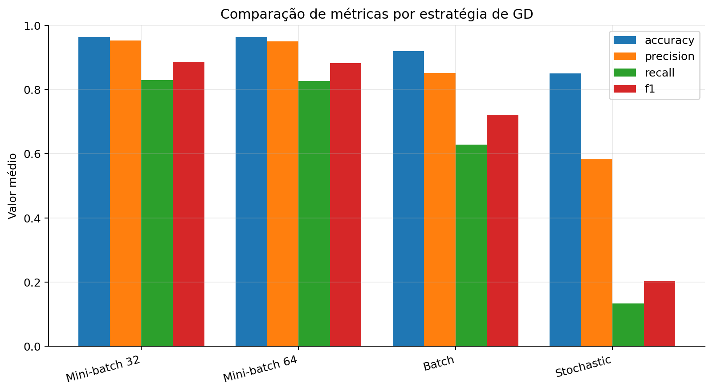
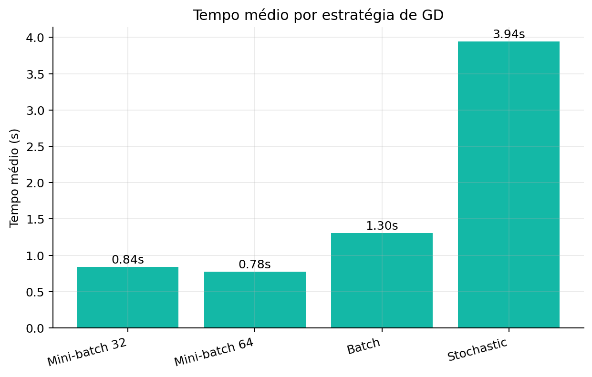
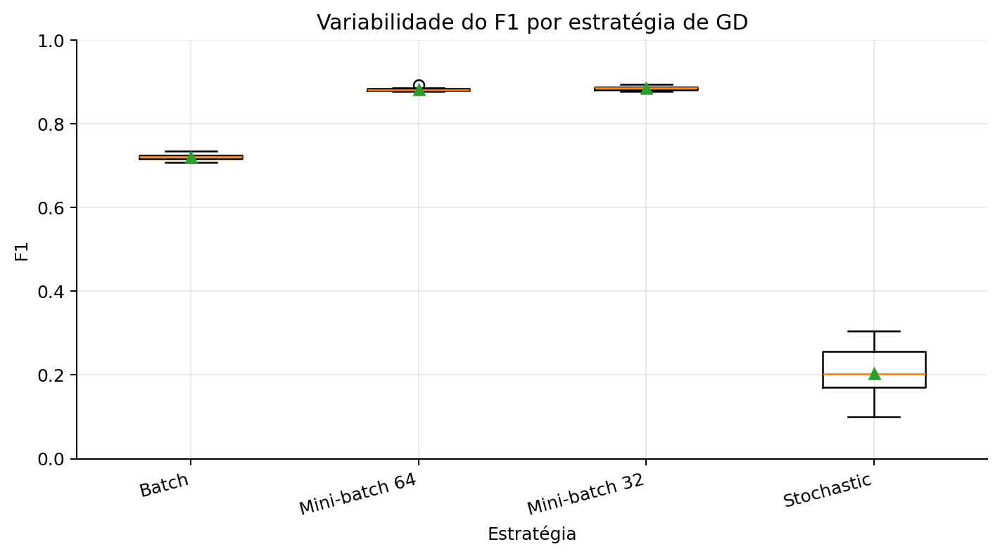
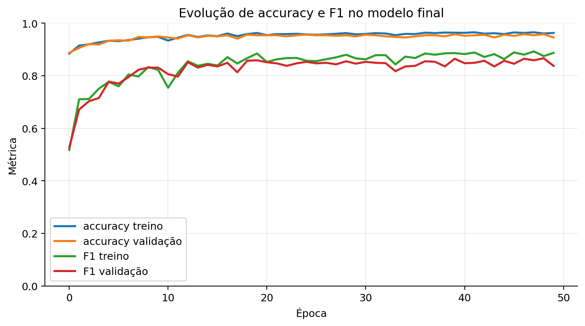
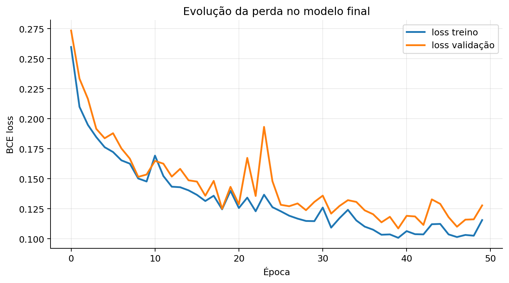
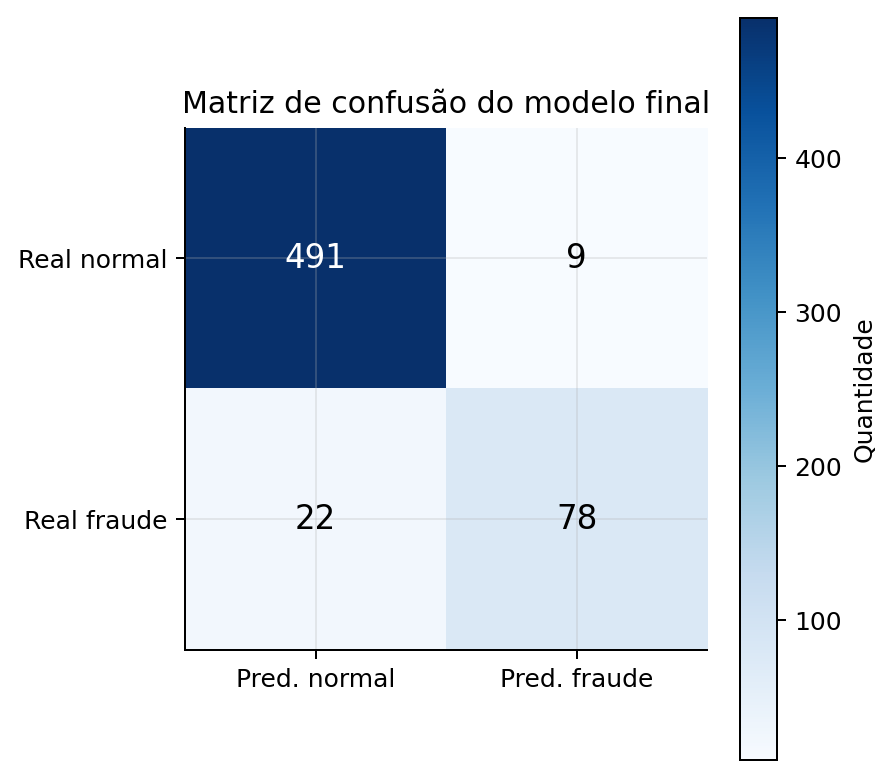

# Relatório — MLP para Detecção de Fraudes Financeiras
#### Alunos: Gilneide Fernanda e André Lucas


## 1. Arquitetura da rede, hiperparâmetros e justificativas

Partindo da topologia sugerida no README (`entrada → 10 → saída`), definimos a seguinte arquitetura em [rede_mlp.py](src/rede_mlp.py):

```text
entrada(11) → [Linear → GELU → Dropout(0.3)] → Linear(→1) → Sigmoid
```

A entrada possui 11 features porque, após o pré-processamento, a coluna categórica `type` foi expandida via one-hot encoding em 5 colunas, somadas às 6 colunas numéricas originais (`step`, `amount`, `oldbalanceOrg`, `newbalanceOrig`, `oldbalanceDest`, `newbalanceDest`).

Optamos por manter **uma única camada escondida** por duas razões. Primeiro, pelo Teorema da Aproximação Universal: uma MLP com uma camada escondida e neurônios suficientes já é capaz de aproximar qualquer função contínua, de modo que camadas adicionais não trazem expressividade necessária para um problema de classificação binária com features tabulares pré-extraídas. Ao contrário de imagens, onde camadas sucessivas aprendem bordas, formas e objetos, aqui não há hierarquia de representações a construir. Segundo, pelo tamanho do dataset: com apenas 1920 amostras de treino por fold, uma rede mais profunda teria mais parâmetros livres e maior risco de sobreajuste sem ganho real de capacidade.

A tabela a seguir resume todos os hiperparâmetros e as razões pelas quais os escolhemos:

| Hiperparâmetro | Valor | Justificativa |
|---|---|---|
| Camadas escondidas | 1 | Problema tabular pequeno; uma camada já satura o desempenho |
| Neurônios escondidos | 10 (base) / **20 (final)** | Fator experimental da seção 2; testamos 5, 10 e 20 |
| Ativação escondida | GELU | É suave e mantém gradiente na região negativa, evitando o *dying ReLU* |
| Ativação de saída | Sigmoid | Comprime a saída em [0, 1], interpretada como probabilidade de fraude |
| Dropout | 0.3 | Desliga 30% dos neurônios por passo, reduzindo dependência de neurônios específicos e ajudando na generalização |
| Função de perda | BCE (`nn.BCELoss`) | Padrão para classificação binária; pune previsões confiantes e erradas. |
| Otimizador | SGD (`optim.SGD`) | Exigido pelo README. A estratégia de GD foi definida pelo `batch_size` . |
| Taxa de aprendizado | 0.01 (base) / **0.5 (final)** | Fator experimental da seção 2; testamos a faixa {0.001, 0.01, 0.05, 0.1, 0.2, 0.5}. |
| Máximo de épocas | 200 | Teto alto para dar margem, o early stopping interrompe bem antes |
| Paciência (early stopping) | 10 | Para o treino após 10 épocas sem melhora na perda de validação |
| Limiar de decisão | 0.5 | `prob ≥ 0.5 → fraude`. |

---

## 2. Escolha dos parâmetros (metodologia e resultados)

### Metodologia

Para garantir que a escolha de hiperparâmetros não "contaminasse" a avaliação final, estruturamos a separação dos dados em [preprocessamento.py](src/preprocessamento.py) da seguinte forma:

1. **Reservamos 20% para teste final** via split estratificado. Esse conjunto nunca foi tocado durante os experimentos.
2. **Nos 80% restantes**, aplicamos **validação cruzada estratificada com 5 folds** (`StratifiedKFold`), mantendo a proporção de fraudes em cada fold.
3. Cada configuração foi executada **10 vezes com sementes distintas** (1 a 10), sendo o resultado de cada execução a média dos 5 folds. Isso nos dá tanto o desempenho médio quanto a variabilidade entre execuções (visualizada nos boxplots).
4. Em cada fold, aplicamos **early stopping** e restauramos os pesos da **melhor época** (menor `val_loss`).

Para o experimento fatorial, escolhemos os dois fatores com maior efeito esperado no resultado: o **número de neurônios** e a **taxa de aprendizado**. Um controla a capacidade da rede e o outro a velocidade de convergência, sendo os dois praticamente independentes entre si, o que facilita a análise da grade. Os demais hiperparâmetros foram mantidos fixos: 1 camada escondida, GELU, dropout 0.3, mini-batch 32, BCE e SGD. O experimento está em [experimentos_fatores.py](src/experimentos_fatores.py) e o ranking em [selecionar_melhor.py](src/selecionar_melhor.py).

A tabela abaixo justifica os valores específicos escolhidos para cada fator:

| Fator | Valores testados | Justificativa |
|---|---|---|
| Neurônios | 5, 10, 20 | 5 neurônios formam uma representação comprimida (menos dimensões que a entrada), 10 correspondem à topologia base sugerida e ficam na mesma ordem da entrada, e 20 dobram essa capacidade. Os três pontos são suficientes para observar se aumentar ou reduzir o espaço escondido impacta a qualidade da fronteira de decisão aprendida. |
| Taxa de aprendizado | 0.001, 0.01, 0.05, 0.1, 0.2, 0.5 | A faixa cobre três ordens de magnitude, partindo de um valor muito conservador (0.001) até um valor agressivo (0.5). Os valores intermediários (0.01, 0.05, 0.1, 0.2) permitem identificar com precisão onde o desempenho começa a saturar, sem saltos grandes demais entre um ponto e outro. |

### Gráficos comparativos







Olhando os gráficos, fica claro que a taxa de aprendizado é o fator mais importante: o F1 sobe de ~0.17–0.33 com `lr = 0.001` até atingir uma estabilidade em ~0.88 a partir de `lr ≈ 0.2`. Já o número de neurônios quase não faz diferença: para uma mesma taxa, passar de 5 para 10 para 20 neurônios muda o F1 em poucos milésimos. 

Em retrospecto, isso indica que variar outro fator no lugar dos neurônios poderia ter sido mais informativo, como a taxa de dropout (que afeta diretamente a regularização em datasets pequenos), a função de ativação ou a paciência do early stopping. Dito isso, achamos a escolha pde variar a taxa de neurônios razoável antes de rodar o experimento, já que o número de neurônios controla quantas combinações lineares da entrada a rede consegue aprender antes de aplicar a ativação, e havia o risco de que 5 neurônios fossem insuficientes para capturar os padrões de fraude num problema com 11 features e classes desbalanceadas. No entanto, os resultados mostraram que a fronteira de decisão desse problema é relativamente simples de representar.

### Boxplot dos resultados



Com `lr = 0.001` a dispersão é grande porque a taxa é pequena demais para o treino convergir dentro do número de épocas disponível, então o resultado varia muito dependendo da semente. A partir de `lr = 0.1` as caixas ficam estreitas e altas, mostrando que o modelo é ao mesmo tempo bom e estável.

### Tabela de métricas médias (10 sementes × 5 folds)

| Neurônios | lr | Accuracy | Precision | Recall | F1 | Tempo (s) |
|---:|---:|---:|---:|---:|---:|---:|
| **20** | **0.5** | **0.9645** | **0.9533** | **0.8288** | **0.8857** | **0.81** |
| 20 | 0.2 | 0.9640 | 0.9500 | 0.8293 | 0.8843 | 1.24 |
| 10 | 0.5 | 0.9641 | 0.9559 | 0.8238 | 0.8838 | 0.74 |
| 10 | 0.2 | 0.9625 | 0.9507 | 0.8183 | 0.8786 | 1.14 |
| 20 | 0.1 | 0.9622 | 0.9500 | 0.8170 | 0.8773 | 1.86 |
| 5 | 0.2 | 0.9622 | 0.9569 | 0.8105 | 0.8765 | 1.09 |
| 5 | 0.5 | 0.9619 | 0.9545 | 0.8115 | 0.8760 | 0.70 |
| 10 | 0.1 | 0.9617 | 0.9499 | 0.8145 | 0.8758 | 1.79 |
| 5 | 0.1 | 0.9599 | 0.9572 | 0.7965 | 0.8682 | 1.69 |
| 20 | 0.05 | 0.9583 | 0.9439 | 0.7980 | 0.8637 | 2.20 |
| 10 | 0.05 | 0.9552 | 0.9425 | 0.7795 | 0.8524 | 2.08 |
| 5 | 0.05 | 0.9531 | 0.9470 | 0.7623 | 0.8437 | 1.93 |
| 20 | 0.01 | 0.9238 | 0.8612 | 0.6483 | 0.7382 | 2.37 |
| 10 | 0.01 | 0.9221 | 0.8615 | 0.6363 | 0.7303 | 2.25 |
| 5 | 0.01 | 0.9188 | 0.8667 | 0.6073 | 0.7125 | 2.28 |
| 20 | 0.001 | 0.8647 | 0.9218 | 0.2068 | 0.3341 | 2.37 |
| 10 | 0.001 | 0.8574 | 0.8349 | 0.1568 | 0.2616 | 2.27 |
| 5 | 0.001 | 0.8483 | 0.7337 | 0.0973 | 0.1667 | 2.29 |

A melhor configuração foi **20 neurônios + lr 0.5** (F1 ≈ 0.886). Notamos que o tempo de treino cai conforme a taxa de aprendizado sobe: de ~2.3 s para ~0.8 s, já que com passos maiores a rede converge em menos épocas e o early stopping para mais cedo.

---

## 3. Comparação Batch × Mini-batch × Stochastic GD

Nessa parte, fixamos a melhor configuração encontrada na seção 2 (20 neurônios, lr 0.5, GELU, dropout 0.3) e variamos **apenas o tamanho do lote**, em [experimentos_gd.py](src/experimentos_gd.py). Testamos dois tamanhos de mini-batch (32 e 64), como o README exige, além do Batch GD e do Stochastic GD. Cada estratégia foi executada 10 vezes.

### Tabela de métricas médias por estratégia

| Estratégia | `batch_size` | Atualizações/época | Accuracy | Precision | Recall | F1 | Tempo (s) |
|---|---|---:|---:|---:|---:|---:|---:|
| **Mini-batch 32** | 32 | ~60 | **0.9645** | **0.9533** | **0.8288** | **0.8857** | 0.84 |
| Mini-batch 64 | 64 | ~30 | 0.9635 | 0.9498 | 0.8260 | 0.8826 | 0.78 |
| Batch | todos | 1 | 0.9197 | 0.8519 | 0.6283 | 0.7216 | 1.30 |
| Stochastic | 1 | ~1920 | 0.8505 | 0.5832 | 0.1332 | 0.2034 | 3.94 |

### Gráficos comparativos

Os gráficos abaixo comparam as métricas médias e o tempo de treino entre as quatro estratégias:





Os dois mini-batches se destacam nas métricas, enquanto Batch e Stochastic ficam bem abaixo. No gráfico de tempo, o Stochastic é o mais lento apesar de ter o pior desempenho, o que reforça que o excesso de atualizações ruidosas por época prejudica tanto a qualidade quanto a eficiência.

### Boxplot por estratégia

O boxplot abaixo mostra a variabilidade do F1 entre as 10 execuções de cada estratégia:



Com base nesses resultados, escolhemos o **mini-batch 32** como estratégia do modelo final.

---

## 4. Evolução da accuracy e F1 por iterações (treino × validação)

Com todos os hiperparâmetros definidos nas seções 2 e 3, treinamos o modelo final e acompanhamos como as métricas evoluíam época a época, separando as curvas de treino e validação. O código está em [modelo_final.py](src/modelo_final.py) e cada época corresponde a aproximadamente 60 atualizações de pesos, já que temos 1920 amostras de treino com lote de tamanho 32.



Treino e validação evoluem praticamente juntos: a accuracy estabiliza em ~0.96 e o F1 em ~0.85–0.88 já nas primeiras 15 épocas, sem que as curvas se separem de forma significativa, o que indica que o modelo aprendeu de forma saudável, não apenas memorizando os dados de treino.



A curva de perda conta a mesma história, mas com mais detalhe: há um pico isolado na validação, e no final a perda de validação fica levemente acima da de treino. Esse afastamento pequeno e gradual é característico de um **overfitting leve e controlado**, esperado numa rede pequena. O early stopping parou o treino antes que esse afastamento se tornasse um problema.

---

## 5. Resultados da melhor configuração


| Hiperparâmetro | Valor |
|---|---|
| Topologia | entrada(11) → 20 → 1 |
| Learning rate | 0.5 |
| Estratégia de GD | Mini-batch GD |
| Batch size | 32 |
| Épocas treinadas | ~50 (parou por early stopping, de um teto de 200) |
| Tempo de treino | ~0.6 s |

### Métricas no conjunto de teste

| Accuracy | Precision | Recall | F1 |
|---:|---:|---:|---:|
| 0.9483 | 0.8966 | 0.7800 | 0.8342 |

### Matriz de confusão



|  | Pred. normal | Pred. fraude |
|---|---:|---:|
| **Real normal** | 491 (VN) | 9 (FP) |
| **Real fraude** | 22 (FN) | 78 (VP) |

O modelo acertou **491** transações normais e **78** fraudes, errando em apenas **9 falsos positivos** e deixando **22 fraudes passarem** (falsos negativos). O F1 no teste (0.834) ficou um pouco abaixo do F1 médio da validação cruzada (0.886), o que é esperado: o conjunto de teste é único e não conta com a média estabilizadora dos 5 folds e das 10 sementes usada durante a seleção de hiperparâmetros.

---

## 6. Discussão dos resultados

### 6.1 Melhor configuração

A melhor configuração encontrada foi **20 neurônios, lr 0.5, mini-batch 32, GELU e dropout 0.3**. Dentre os dois fatores analisados, a taxa de aprendizado foi o mais decisivo, e o número de neurônios quase não influenciou, pois, para esse problema, a rede já satura a capacidade com poucos neurônios.

### 6.2 Ocorrência de overfitting

O overfitting observado foi **leve e controlado**. Nas curvas do modelo final (seção 4), treino e validação caminham juntos e não houve a divergência em que a perda de treino cai enquanto a de validação sobe de forma sustentada. A queda do F1 da validação cruzada (~0.88) para o teste (0.83) é uma de generalização normal para um conjunto de dados pequeno e desbalanceado.

### 6.3 Efeito do dropout

O dropout de 0.3 funcionou como regularização, impedindo que a rede dependa de caminhos específicos e a força a generalizar. Esse efeito aparece de forma indireta nas curvas do modelo final: a pequena distância entre as métricas de treino e validação indica que a rede não está memorizando os dados. Para uma rede pequena como a nossa (apenas 261 parâmetros), o dropout é uma das principais ferramentas para conter o sobreajuste.

### 6.4 Efeito do early stopping

O early stopping (paciência 10, teto de 200 épocas) interrompeu o treino do modelo final em **~50 épocas** e restaurou os pesos da melhor época, não os da última. Isso é visível na curva de perda, onde há oscilações na validação (como o pico no gráfico de Evolução da perda) e leve subida no final. Sem o early stopping, o treino continuaria até as 200 épocas, arriscando começar a sobreajustar e desperdiçando processamento. Ele também explica por que taxas de aprendizado maiores treinam mais rápido: convergindo antes, a parada é acionada mais cedo.

### 6.5 Comparação Batch × Mini-batch × Stochastic

- **Batch GD**: uma única atualização por época foi insuficiente para aprender dentro do limite de épocas.
- **Stochastic GD**: atualizações individuais por exemplo com lr alto tornaram o treino instável e lento.
- **Mini-batch**: melhor equilíbrio entre frequência de atualização e estabilidade.

Entre os lotes 32 e 64, o 32 teve desempenho levemente superior com diferença de tempo irrelevante. Lotes menores fazem mais atualizações por época e introduzem um ruído moderado que ajuda a generalizar, o que explica os mini-batch terem se saído melhor.